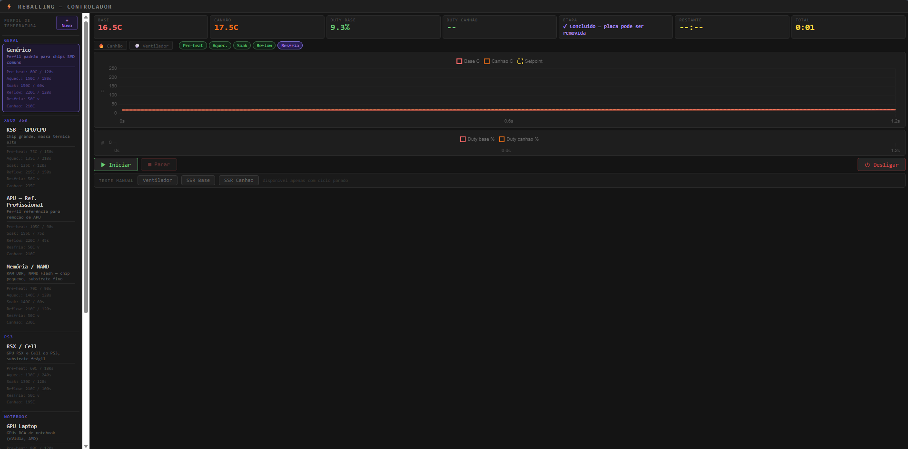
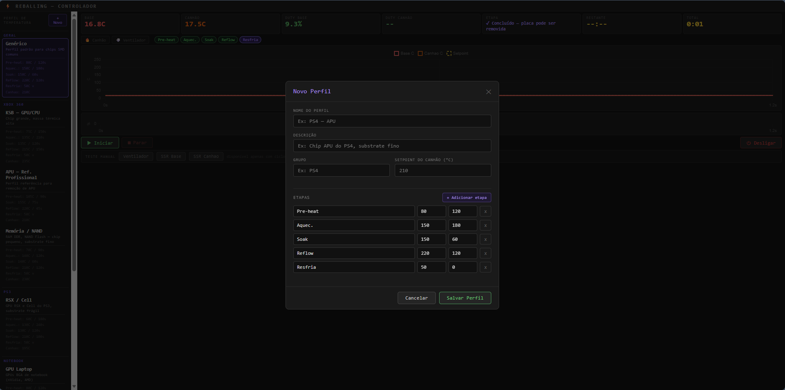
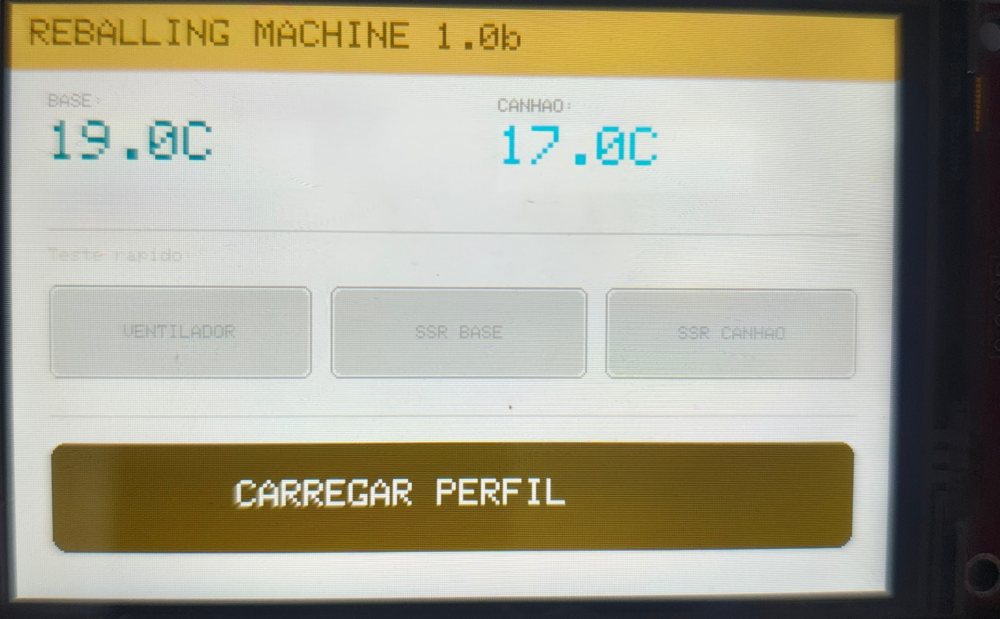
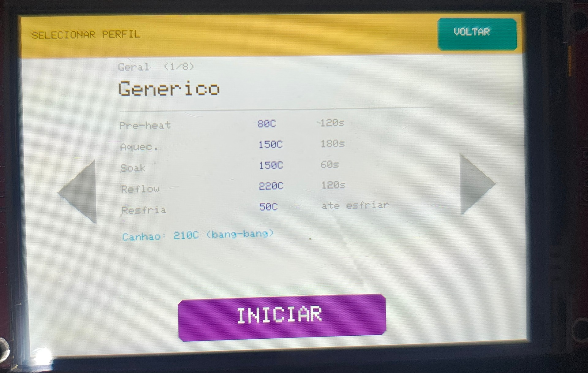

# 🔥 Reballing Machine 1.0b

Controlador completo de máquina de reballing caseira, construído com **Raspberry Pi**, **ESP32** e muita iteração de hardware. Controla base (bottom heater) e canhão de ar quente (top heater) com PID, perfis de temperatura por chip, painel físico touch e interface web em tempo real.

Projeto pessoal documentado e aberto para a comunidade de reparo eletrônico — se você está montando a sua própria máquina, espero que isso poupe um bom tempo de tentativa e erro.


---

## ✨ Funcionalidades

- **Controle PID** independente para a base, com rampa suavizada no pré-aquecimento (evita overshoot)
- **Controle bang-bang com pulso mínimo** para o canhão de ar — mais estável que PID quando há distância física entre bocal e placa
- **7 perfis de temperatura validados** em testes reais (Xbox 360, PS3, notebooks, memórias/NAND)
- **Criação de perfis customizados** direto na interface web, sem tocar em código
- **Alertas sonoros físicos** (buzzer) e visuais sincronizados: troca de etapa, aviso de "sacar o chip", fim do reflow, ciclo concluído
- **Logs CSV automáticos** de cada ciclo — temperatura, duty cycle, ventilador, tudo registrado
- **Painel físico opcional (ESP32 + display touch ILI9488)**: standby com sensores ao vivo, seleção de perfil por toque, tela de ciclo ativo com mini-gráfico
- **Testes manuais de hardware** (ventilador, SSR base, SSR canhão) via browser ou display físico
- Interface web responsiva com gráficos em tempo real via Server-Sent Events

---

## 📸 Capturas de tela

### Interface web

| Painel principal (ciclo concluído) | Criação de perfil customizado |
|---|---|
|  |  |

### Painel físico (ESP32 + display touch)

| Tela de standby | Seleção de perfil |
|---|---|
|  |  |

---

## 🧱 Arquitetura

```
┌─────────────────────────┐         WiFi/HTTP        ┌──────────────────┐
│      Raspberry Pi         │ ◄──────────────────────► │   ESP32 DevKit    │
│  • Flask + PID/bang-bang  │     polling 1x/seg        │  • Display ILI9488│
│  • MAX6675 x2 (SPI)       │                            │  • Touch XPT2046  │
│  • SSRs, ventilador, buzzer│                           │  • Menu standalone│
│  • Logs CSV                │                           └──────────────────┘
└─────────────────────────┘
            ▲
            │ HTTP / SSE
            ▼
┌─────────────────────────┐
│   Browser (qualquer dispositivo)  │
│  • Interface completa             │
│  • Gráficos em tempo real         │
│  • Criação de perfis              │
└─────────────────────────┘
```

O ESP32 e o display são **totalmente opcionais** — o sistema roda completo só com o Raspberry Pi e a interface web.

---

## 🛠️ Hardware necessário

### Controlador principal
| Item | Especificação |
|---|---|
| Raspberry Pi | 3B+ ou 4B |
| MAX6675 x2 | Módulo SPI para termopar tipo K |
| Termopar tipo K x2 | Faixa 0–1200°C |
| SSR (base) | Fotek 25DA ou similar, 3-32V DC → 24-380V AC |
| SSR (canhão) | SSR DC-AC |
| Módulo relé 2/8 canais | Ventilador + buzzer |
| Buzzer ativo 5V | Alertas sonoros |
| Resistência de base | Conforme sua câmara |
| Canhão de ar quente | Com ajuste de temperatura/fluxo |
| Ventilador | DC ou AC |

### Painel físico (opcional)
| Item | Especificação |
|---|---|
| ESP32 DevKit V1 | 30 pinos |
| Display ILI9488 | 320x480 SPI, touch XPT2046 |

Pinout completo, ligações detalhadas e diagrama de blocos estão em **[`docs/reballing_documentacao.docx`](docs/reballing_documentacao.docx)**.

---

## 🚀 Instalação

### 1. Raspberry Pi

```bash
# Habilita SPI
sudo raspi-config   # Interface Options → SPI → Enable

# Cria o ambiente
mkdir -p ~/reballing/logs
cd ~/reballing
python3 -m venv venv
source venv/bin/activate
pip install flask spidev RPi.GPIO

# Copia reballing.py e run_reballing.sh para ~/reballing/
chmod +x run_reballing.sh
./run_reballing.sh
```

A interface fica disponível em `http://<IP-do-Raspberry>:5000`.

### 2. Rodando em segundo plano com PM2 (recomendado)

```bash
curl -fsSL https://deb.nodesource.com/setup_lts.x | sudo -E bash -
sudo apt-get install -y nodejs
sudo npm install -g pm2

cd ~/reballing
sudo pm2 start ecosystem.config.js
sudo pm2 save
sudo pm2 startup
```

### 3. Painel físico ESP32 (opcional)

Requer [PlatformIO](https://platformio.org/) (extensão do VS Code).

1. Abra a pasta `reballing-display/` no VS Code
2. Edite `src/main.cpp` com suas credenciais:
   ```cpp
   const char* WIFI_SSID = "sua_rede";
   const char* WIFI_PASS = "sua_senha";
   const char* RASP_HOST = "http://192.168.x.x:5000";
   ```
3. Build (✓) e Upload (→) com o ESP32 conectado via USB

---

## 📋 Perfis incluídos

| Perfil | Grupo | Chip alvo |
|---|---|---|
| Genérico | Geral | Chips SMD comuns |
| KSB — GPU/CPU | Xbox 360 | Chip grande, massa térmica alta |
| APU — Ref. Profissional | Xbox 360 | Baseado em referência técnica de mercado |
| Memória / NAND | Xbox 360 | RAM DDR e NAND Flash |
| RSX / Cell | PS3 | GPU/CPU do PS3, substrate frágil |
| GPU Laptop | Notebook | GPUs BGA (nVidia, AMD) |
| Chipset / Northbridge | Notebook | Chipsets Intel/AMD |

Todos os setpoints e durações detalhados estão na documentação técnica. Você também pode **criar seus próprios perfis** direto na interface web — sem editar código.

---

## ⚠️ Segurança

Este projeto envolve **220V AC** e temperaturas de até **260°C**. Antes de ligar:

- Nunca toque nos terminais AC dos SSRs com o equipamento energizado
- Use bornes adequados, nunca deixe fios de 220V expostos
- Instale disjuntor/fusível de proteção
- O corte de segurança por software (`MAX_TEMP = 260°C`) nunca deve ser desabilitado
- Use EPIs e mantenha extintor de incêndio por perto nos primeiros testes
- Aguarde a base esfriar abaixo de 60°C antes de tocar na placa

Leia a seção de segurança completa na documentação técnica antes de montar.

---

## 📁 Estrutura do repositório

```
.
├── reballing.py                 # Controlador principal (Raspberry Pi / Flask)
├── ecosystem.config.js          # Config do PM2
├── run_reballing.sh             # Script de inicialização
├── reballing-display/           # Firmware do painel físico (ESP32 / PlatformIO)
│   ├── platformio.ini
│   └── src/main.cpp
├── screenshots/                 # Capturas de tela usadas neste README
└── docs/
    └── reballing_documentacao.docx   # Documentação técnica completa
```

---

## 🧠 Decisões técnicas que valem a pena conhecer

- **Por que bang-bang no canhão em vez de PID?** A distância física entre o bocal e a placa introduz atraso de resposta grande o suficiente para o PID oscilar sem controle. Bang-bang com pulso mínimo (`GUN_MIN_ON_S`) resolveu de forma muito mais estável.
- **Por que o display foi migrado do Raspberry Pi para um ESP32?** Bit-bang de SPI por software no Python competia pelo GIL e travava a leitura dos termopares. Um ESP32 dedicado, consultando o Rasp via HTTP, resolveu — e como bônus, o touch também passou a funcionar (no Rasp o MISO era compartilhado entre termopares e touch, causando conflito).
- **Por que sem retry automático no SSE do browser?** Reconexões automáticas em loop, sem fechar a conexão anterior, vazavam `EventSource` e travavam o navegador depois de um tempo. A solução foi um banner de reconexão manual.

---

## 🎥 Vídeo

Este projeto está sendo documentado em vídeo para o YouTube, mostrando a evolução completa — do primeiro teste com overshoot de +29°C até os ciclos de produção validados. Link em breve.

---

## 🤝 Contribuindo

Sugestões, issues e pull requests são bem-vindos! Se você montar a sua versão, manda foto — adoraria ver o projeto rodando em outras bancadas.

---

## 👤 Autor

**Fabio Leal de Oliveira Machado**
📧 fabiolmachado@gmail.com

Se este projeto te ajudou e quiser retribuir, fica à vontade para fazer uma doação via PIX:

**Chave PIX:** `fabiolmachado@gmail.com`

---

## 📜 Licença

Este projeto é open-source. Use, adapte e compartilhe à vontade — só lembre de seguir as práticas de segurança elétrica e térmica descritas na documentação.
